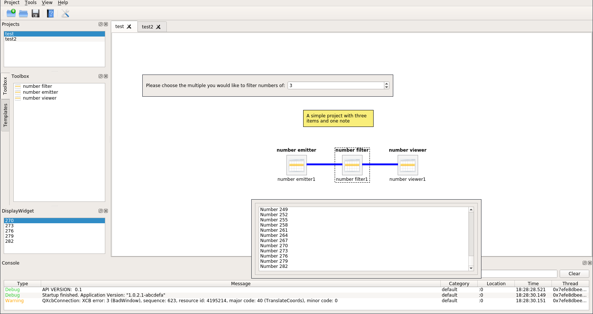

# Item Framework
The Itemframework is a Library which helps you create complex QT GUI Applications. Your application can create Items (provided as plugins) which can be connected by the user in a defined manner. Each Item can have it's own user interface, storage data and more..

## Features
* [Projects & Workspaces](docs/projects.md): Items and their configuration can be saved to and loaded from projects. Projects can be grouped in Workspaces.
* [Items & Connectors](docs/items.md): Your application will have a set of items which the user can connect, configure and arrange to form a project. Each Item has a type, and a number of inputs and ouputs (of a certain type) and it's own user-interface and behaviour.
* [Storage & Settings System](docs/storage.md): Complex User-defined Types can automatically be serialized/deserialized and will be stored in the project. Apart from that you can also create settings that the user can override on application level, workspace, project or item level.
* [Plugin System](docs/plugins.md): The End-User Application can be extended by Plugins. You can introduce own types of plugins and plugins can also have subplugins. The User can enable/disable plugins in the User Interface.
* [Singleton's and Static Initialization](docs/singletons.md): Complex Applications sometimes have to use static initialiation and singelton patterns. The Itemframework provides a set of helpers to facilitate the development process.
* Gui Manager: Extend and customize the Appearance of your application

## Structure & Usage

An itemframework project consists of the following components:

### Core
Core functionality provided by the itemframework.

### Usercore
User-defined core extensions.

This is where definitions for common interfaces are placed. The implementations of these interfaces are typically placed in plugins. Types defined here can be used by all plugins.

Extensions may include interface definitions, data types, widgets to be included in the main window, and manager classes that are available to all plugins.

Classes in the usercore may optionally be registered as [components or singletons](docs/singletons.md).

### Plugins
User-defined plugins.

A plugin is usually either a graphical item or an implementation of an interface defined in the usercore.

Each plugin is separate and does not generally have access to any other plugins other than those defined in the same plugin container. Plugins are compiled to separate dynamic library files and loaded dynamically at runtime.

Graphical items typically have at least an input or an output. Inputs and outputs with the same transport type can be interactively connected by the user to enable the flow of data between two items.

For a more detailed description, consult the [plugin system](docs/plugins.md) documentation.

## Example
To get started, clone the [Example Project](https://github.com/rdit-ch/itemframework-example) and modify that.  

## License
GPLv3. Contact us if you would like to use it under a different license (e.g. commercial).

## Contact
Rdit.ch  
[contact@rdit.ch](mailto:contact@rdit.ch)
