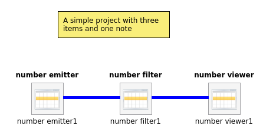

# Projects & Workspaces

* List features of project&workspace gui 
* show example twsp and tpro files

## Example Workspace File

```
<?xml version="1.0"?>
<!DOCTYPE TravizpWorkspaceXML>
<TravizWorkspace description="" version="1.0" name="test">
 <TravizProject fastLoad="true">
  <ProjectConnection path="./test.tpro"/>
 </TravizProject>
</TravizWorkspace>

```

## Example Project File



```
<?xml version="1.0"?>
<!DOCTYPE TravizpProjectXML>
<TravizProject version="2.0" description="No description set." name="test">
 <GraphicsItemNote x="-82" y="-99">
  <GraphicsItemNoteData content="A simple project with three items and one note" width="180" color="fff9ee7a"/>
 </GraphicsItemNote>
 <GraphicsItem x="200" y="50" type="NumberViewerItem" id="0" name="number viewer1"/>
 <GraphicsItem x="-100" y="50" type="NumberEmitterItem" id="1" name="number emitter1"/>
 <GraphicsItem x="50" y="50" type="NumberFilterItem" id="2" name="number filter1">
  <GraphicsItemData>
   <property type="NumberFilterConfig" name="config">
    <qgadget>
     <property value="3" type="int" name="modulus"/>
    </qgadget>
   </property>
  </GraphicsItemData>
 </GraphicsItem>
 <GraphicsItemConnector fromIndex="0" toIndex="0" transportType="NumberTransporter*" fromItem="2" toItem="0"/>
 <GraphicsItemConnector fromIndex="0" toIndex="0" transportType="NumberTransporter*" fromItem="1" toItem="2"/>
</TravizProject>

```